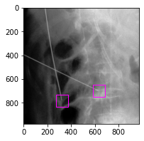
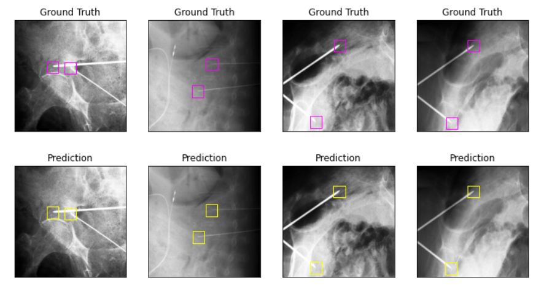
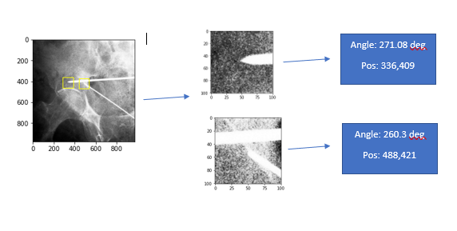
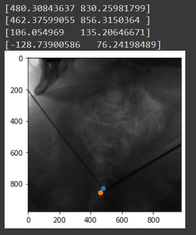
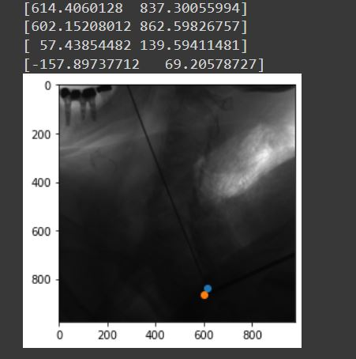
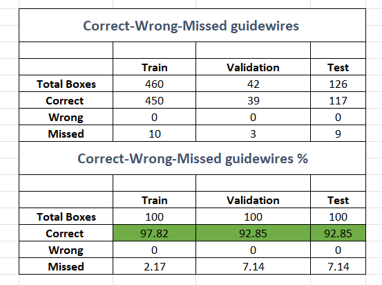
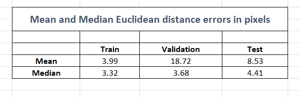
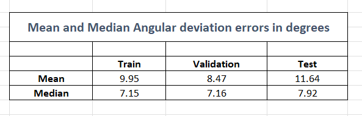

# Guidewire-position-direction-estimation
The goal of the project is to estimate the position and orientation of the guidewire tips from fluoroscopic images

A guidewire is a thin, flexible, medical wire inserted into the body to guide a larger instrument, such as a catheter, central venous line, or feeding tube. Guidewires are majorly used in orthopaedic surgeries as guiding heuristics for inserting and screw fixation tasks. Surgeons identify the position and direction of these guidewires to navigate and perform the major procedure. 

In current standard of care,  the accurate positioning of guidewires often involves trial-and- error and long fluoroscopic exposure times. To avoid these long exposure times on patients and to assist the surgeons better there is a need for an automated system to locate these guidewires and to provide real time tracking of direction and position of these guidewires.  

# Project Details:
The proposed solution is a two staged network based solution. Stage 1 uses a Faster RCNN deep framework  to locate and bound guidewire tips while stage 2 uses a resent101 based deep framework to predict the angle and offset of the guidewire tip from the bounds from stage 1. The solution as a whole is used to estimate the position (in pixels) and direction(in angle) of the guidewires in a given fluoroscopic image.

For more details please refere the analysis report (Report.pdf)

# Guidewire tips - Predictions - Results:

Sample input image after preprocessing - purple bounding box indicate the location og guidewire tips:

Stage 1 Results:

Stage 1 and Stage 2 result Example - Automated Pipeline:

Evaluation Results:

